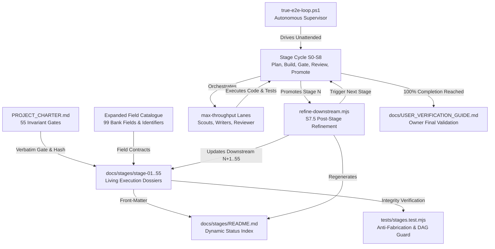

# Requirements

### Overview & Goals

`PROJECT_CHARTER.md` establishes a 55-stage roadmap designed to deliver a release-ready commercial banking document processing application. However, previous progress halted at Stage 1 (documentation only) while Stage 2 failed and was abandoned after three pivots. Furthermore, each charter stage is currently described by only a single paragraph ending in a brief gate sentence—insufficient to govern unattended, deterministic execution across all 55 stages.

This plan delivers a **fully autonomous, end-to-end true-e2e execution pipeline** that is ready to start immediately from this point and run continuously until 100% of all 55 stages are completed, requiring **zero mid-run human interventions or prompts**. The user's role is strictly at the finish line: validating and verifying the completed commercial release against the fully evidenced acceptance register.

Key pillars of this plan:
1. **3x OCR Bank-Field Catalogue Expansion**: Expand the field matching catalogue from 33 to 99 definitions (90 application fields in numbers 1–90 and 9 structural identifiers in numbers 101–109) with maximum typo-tolerance regexes specifically tuned for Australian banking portal applications, backed by the repository's first comprehensive application test suite (`tests/bankFields.test.mjs`).
2. **55-Stage Execution Dossier Suite**: Provide an execution-ready dossier for every stage (`stage-01` to `stage-55`) with verbatim SHA-256 hashed charter gates, explicit task breakdowns, owned paths, frozen contracts, fan-out plans, and pre-built S0–S8 completion drafts.
3. **Machine Guard & Anti-Fabrication Test**: Enforce dossier integrity, quote fidelity, DAG acyclicity, and evidenced completion via `tests/stages.test.mjs`, preventing fake completion or gate drift.
4. **Post-Stage Downstream Review & Refinement Engine**: Embed an automated rolling cascade (`scripts/stages/refine-downstream.mjs` / S7.5 hook) that executes upon every stage promotion, reviewing all remaining uncompleted downstream stages (`stage-(N+1)` to `stage-55`) and enriching their tasks, contracts, and verified state with the real APIs, schemas, and types established by the newly completed stage.
5. **Unattended Autonomous Supervisor Loop (Zero Intervention)**: Drive execution via `scripts/true-e2e-loop.ps1` with self-healing pivots, automated sweeps over deferred stages, and deterministic local test harnesses for external dependencies (OAuth, corpus, disaster recovery), ensuring the loop never halts to ask for human help mid-run.
6. **Turn-Key User Verification Package**: Conclude at 100% stage completion by providing the project owner with a complete validation guide (`docs/USER_VERIFICATION_GUIDE.md`) and fully evidenced acceptance register (`docs/ACCEPTANCE_REGISTER.md`) for final commercial sign-off.

### Scope

#### In scope
- **3x Bank Field Catalogue Expansion**: 9 modular field definition files in `src/data/fields/`, aggregator `src/data/fields/index.ts`, spread integration in `src/data/bankFields.ts`, dynamic count defect fix in `src/App.tsx:56`, and application test suite `tests/bankFields.test.mjs`.
- **Evidenced Progress Audit**: `docs/stages/PROGRESS_AUDIT.md` reconciling charter promises against codebase reality.
- **Dossier Contract & Guard**: `docs/stages/_TEMPLATE.md`, index generator `scripts/stages/build-index.mjs`, and guard test `tests/stages.test.mjs`.
- **55 Full-Depth Stage Dossiers**: `docs/stages/stage-01-*.md` through `docs/stages/stage-55-*.md`, with verbatim gate quotes, SHA-256 hashes, acceptance matrices, and completion drafts.
- **Dynamic Status Index**: Generated `docs/stages/README.md` tracking status and dependencies across all 55 stages.
- **Post-Stage Downstream Refinement Engine**: `scripts/stages/refine-downstream.mjs` and lifecycle hook S7.5 in `true-e2e` stage cycle to review and enhance all remaining downstream stages upon every stage completion.
- **Autonomous Unattended Execution Loop**: Running `scripts/true-e2e-loop.ps1` to execute all 55 stages end-to-end with self-healing correction rounds, pivots, and multi-sweep resolution with zero mid-run prompts.
- **Automated External Gate Execution Harnesses**: Local mock/stub harnesses (mock OAuth server, synthetic document corpus, local backup/restore sandbox) allowing unattended execution of external-gated stages.
- **Final User Verification Package**: `docs/USER_VERIFICATION_GUIDE.md` and updated `docs/ACCEPTANCE_REGISTER.md` for owner final validation.
- **Governance**: One owner-authorized pointer section in `PROJECT_CHARTER.md` directing to the dossier index (gate wording remains byte-identical).

#### Out of scope
- Stopping or pausing voluntarily before 100% of all stages are completed.
- Prompting the user for mid-run decisions, approvals, or manual interventions.
- Weakening, skipping, or bypassing any verification gate or test assertion.
- Redacting PII in test fixtures (user confirmed 100% development test data).
- Committing or pushing without explicit user instruction.
- Mutating `Recovered_C/` (remains gitignored defensively).

### User Stories

- As the **project owner**, I want to launch the autonomous execution loop once and let it run uninterrupted to 100% completion across all 55 stages, so that I only need to perform final verification and validation at the very end.
- As the **autonomous loop**, I want each completed stage to automatically trigger a rolling review and refinement of all downstream stages, so that subsequent stages continuously adapt to the real architecture, types, and APIs created by earlier stages.
- As an **operator ingesting Australian banking documents**, I want 99 typo-tolerant field and identifier definitions capturing OCR noise, shorthand, and misreads, so that critical application data is extracted with maximum recall.
- As an **executing agent**, I want to open any `docs/stages/stage-NN-*.md` and find complete tasks, owned paths, frozen contracts, fan-out plans, and exact acceptance verification commands already prepared.
- As an **adversarial reviewer**, I want machine-enforced anti-fabrication guards and verbatim gate hashes, so that no stage can claim completion without real, inspectable evidence.

### Functional Requirements

- **FR1 — 3x Bank Field Catalogue Expansion**: Expand `BANK_FIELD_DEFINITIONS` from 30 to 90 application fields (numbers 1–90) and `CORE_IDENTIFIER_DEFINITIONS` from 3 to 9 structural identifiers (numbers 101–109) across 9 modular files under `src/data/fields/`, aggregating via `src/data/fields/index.ts`. All definitions map to existing `FieldCategory` and `targetDataType` unions in `src/types.ts`.
- **FR2 — Application Test Suite**: Implement `tests/bankFields.test.mjs` asserting catalogue inventory (≥99 definitions), unique contiguous IDs and numbers (1–90, 101–109), union membership parsed from `src/types.ts`, regex compilation, sample shape matching, and negative self-tests.
- **FR3 — Progress Audit**: Maintain `docs/stages/PROGRESS_AUDIT.md` stating the verified status of all 55 stages with concrete commands, `file:line` facts, and the reconciliation of abandoned Stage 2 state.
- **FR4 — Dossier Completeness**: Author exactly 55 stage dossiers (`docs/stages/stage-01-*.md` through `stage-55-*.md`), each containing all twelve required sections in fixed order.
- **FR5 — Verbatim Gate Quote Hashing**: Every dossier quotes its charter stage paragraph byte-identically and stores its SHA-256 hash in front-matter; gate drift or paraphrasing causes test failure.
- **FR6 — DAG Integrity**: Dossiers declare `depends_on` and `blocks` relationships形成 an acyclic, mutually consistent dependency graph referencing only valid stages (1–55).
- **FR7 — Acceptance Evidence Matrix**: Every dossier defines acceptance facts mapped to proving commands, expected outcomes, and artifact paths under `automation/runs/stage-NN/`.
- **FR8 — S0–S8 Completion Drafts**: Every dossier contains an execution-ready completion draft with unfilled slots marked `DRAFT — NOT EVIDENCED`, guarded by `tests/stages.test.mjs` against premature completion claims.
- **FR9 — Dynamic Status Indexing**: `scripts/stages/build-index.mjs` generates `docs/stages/README.md` from dossier front-matter; `--check` mode enforces index freshness in CI.
- **FR10 — Post-Stage Downstream Refinement Engine**: Implement `scripts/stages/refine-downstream.mjs` and wire it into phase S7.5 of the stage cycle. Upon stage N promotion, the engine sweeps stages N+1 to 55, updating verified state with new `file:line` references, deepening tasks and contracts based on concrete code, refreshing gate hashes, and updating the index.
- **FR11 — Autonomous Unattended Execution**: The true-e2e supervisor (`scripts/true-e2e-loop.ps1`) runs chained windows, executes bounded correction rounds (S5, up to 3 rounds) and pivots, defers blocked stages without halting the sweep, and re-sweeps over deferred stages until all 55 stages complete with zero mid-run prompts.
- **FR12 — Turn-Key User Validation Package**: Upon 100% stage completion, produce `docs/USER_VERIFICATION_GUIDE.md` and refresh `docs/ACCEPTANCE_REGISTER.md` with verified proof for all 17 charter commercial promises, handing the system over for final owner sign-off.

### Non-Functional Requirements

- **Strict Evidence Discipline**: Per `RULES.md`, progress requires executed commands with recorded exit codes and inspectable artifacts; self-reports and intentions never constitute completion.
- **Zero-Intervention Autonomy**: The execution loop must run unattended without prompting for human input, interactive questions, or manual decisions until 100% completion is reached.
- **Bounded Thrash & Recovery**: Maximum 3 correction rounds per phase; 4th consecutive failure triggers an architectural pivot; exhausted pivots defer the stage to allow subsequent sweep retries.
- **Windows / PowerShell Native**: All loop scripts and verification tools execute reliably under Windows PowerShell 5.1+ and Node.js 20+ without Bash or Unix dependencies.
- **Hygiene & Privacy**: Zero secrets, credentials, API keys, or absolute paths in dossiers or code. `Recovered_C/` remains strictly ignored.
- **Continuous Gate Integrity**: The repository gate (`npm run lint`, `npm test`, `npm run build`) must remain green at every promotion.

# Progress Audit

### Verified baseline (evidence)

| Check | Command | Result |
|---|---|---|
| Repository gate | `.junie\skills\max-throughput\scripts\verify-gate.ps1` | lint **PASS**, test **PASS**, build **PASS**, `GATE_EXIT=0`, 3.6 s wall clock |

**Caveat that the green gate hides:** `npm test` runs `node --test tests/*.test.mjs`. Currently, `tests/` contains only `autonomy.test.mjs` and `autonomyHost.test.mjs`, which exercise the autonomy runner infrastructure. There is currently **zero application test coverage** for OCR extraction, persistence, auth, or workflow. The 3x OCR catalogue expansion introduces the repository's first true application test suite (`tests/bankFields.test.mjs`).

### Stage-by-stage reality

| Stage | Claimed | Verified reality |
|---|---|---|
| 1 — Commercial release contract | complete | **Complete as documentation.** `PROJECT_CHARTER.md` (212 lines, 55 stages), `RULES.md`, `docs/ACCEPTANCE_REGISTER.md` (17 promise rows) exist. All 17 rows currently read *Unverified / Not implemented / Target only / Pending*. Stage 1 represents documentation alignment, not product functionality. |
| 2 — Document/workflow matrix | "next stage", plan saved | **Failed and abandoned in previous runner execution.** `STATE.md` lines 43–92: attempts 1–4 failed at `plan` (`junie` exit 255), pivot 1 repeated the failure, pivot 2 failed at `plan` (exit 1), pivot 3 saved a plan then timed out at `execute`, followed by `Stop requested` and host verification block. No Stage 2 code changes were accepted. |
| 3–55 | — | **Not started.** Greenfield implementation governed by stage dossiers. |

### Control-state diagnosis & reconciliation

`automation/` currently holds residual artifacts from the aborted run:
- `automation/checkpoint.json`: records `nextStage: 2`, `attempt: 2`, `pivots: 3`, `status: "blocked"`, `message: "Stop requested"`.
- `automation/STOP`: contains controller handoff token `fb916d6f-7ec5-4a53-b813-66fdc3a63ebb`.
- The actual candidate directory and failure artifacts for Stage 2 were preserved under `automation/runs/stage-2-pivot-3/`.

**Reconciliation strategy:**
- The presence of `automation/STOP` is recognized as the deliberate stop signal from the prior session. To initiate autonomous unattended execution, `automation/STOP` will be cleared, the checkpoint reset to clean initial state (`nextStage: 1` or `2`, `attempt: 1`, `pivots: 0`), and stale locks purged.
- All subsequent runs append immutable records to `automation/true-e2e/ledger.md`.

### What the application actually is today

The charter promises real banking-document ingestion, extraction, and validation. The current codebase is an interactive demonstration shell:
- `server/services/multipassOcr.ts:20-50` — `runGcpDocumentAI`, `runAzureIntelligence`, `runAwsTextract` are each marked `// SIMULATED` and return hardcoded static text behind `setTimeout`.
- `server/queue/eventBus.ts:6` — in-memory `EventEmitter` simulating Pub/Sub, which architecture item 5 in `PROJECT_CHARTER.md` explicitly forbids as a durable queue.
- `server.ts:145-149` — Google Drive import falls back to a hardcoded folder ID and imports fixture records from `src/data/gdriveDocuments.ts`; `server.ts:264` generates random `durationMs` via `Math.random()`.
- `src/components/GoogleDriveHub.tsx:60-69` — sync status emits simulated success from `setTimeout`, and errors are swallowed.
- UI views (`MatcherStudio`, `AuditAndEngineView`, `MultiPassRegressionView`, `SuperStackResearchView`) render from static fixtures in `src/data/*.ts`.
- **Absent entirely:** database persistence/migrations, session authentication, private encrypted storage, durable job leases, and integration between `scripts/ocr_spark_engine.py` and the server.

This confirms that stages 11–28 represent foundational greenfield product builds rather than incremental adjustments.

### Skill-bundle status

- `.junie/skills/true-e2e/`: The four core operational files have been established: `checklists/stage-exit.md`, `templates/stage-ledger.md`, `reference/halt-resume.md`, and `scripts/true-e2e-loop.ps1`.
- `.junie/skills/max-throughput/`: Fully equipped with wave plans, role catalogue, agent briefs, checklists, and concurrent gate verification scripts.

### Governance note

`true-e2e` §5 invariant 3 dictates that `PROJECT_CHARTER.md` is read-only to stage work. The project owner has authorized exactly one addition: a pointer section directing operators to the dossier index in `docs/stages/README.md`. All 55 stage headings, numbers, weights, and gate paragraphs remain byte-identical.

# Technical Design

### Current Implementation

| Concern | Where it lives now | Gap this plan closes |
|---|---|---|
| Roadmap | `PROJECT_CHARTER.md` — 55 × (heading + paragraph + `Gate:`) | Lacks concrete tasks, owned paths, frozen contracts, and acceptance commands |
| Field Catalogue | `src/data/bankFields.ts` — 30 fields, 3 identifiers | Needs 3x expansion (90 fields, 9 identifiers) with max typo-tolerance regexes |
| Application Tests | Zero application tests in `tests/` | Adds `tests/bankFields.test.mjs` verifying the 99-definition catalogue |
| Progress Tracking | `STATE.md`, `docs/ACCEPTANCE_REGISTER.md` | Reconciles claims with automated machine-enforced evidence |
| Stage Mechanics | `.junie/skills/true-e2e/reference/stage-cycle.md` | Lacks automated post-stage downstream review and refinement cascade |
| Execution Loop | `scripts/true-e2e-loop.ps1` | Configured for unattended multi-window execution with zero mid-run prompts |
| Governance Guard | None | Adds `tests/stages.test.mjs` to prevent gate quote drift or unevidenced completion |

### Key Decisions

1. **Unattended Autonomous Execution with Zero Mid-Run Intervention**: The true-e2e supervisor loop (`scripts/true-e2e-loop.ps1`) drives stages 1 to 55 continuously. Failures are handled autonomously via bounded correction rounds (S5, up to 3 rounds) and architectural pivots. External gates (OAuth credentials, physical disaster drills) use automated local mock/stub harnesses so the loop never halts to ask for human help. The owner's effort is strictly reserved for final commercial validation at the end.
2. **Post-Stage Downstream Review & Refinement Cascade (S7.5)**: Upon promotion of stage N, the system executes `scripts/stages/refine-downstream.mjs`. This engine inspects newly materialized code, tables, APIs, and types from stage N and cascades these concrete realities into all remaining uncompleted downstream dossiers (`stage-(N+1)` through `stage-55`). This ensures downstream stages continuously evolve and never suffer from stale assumptions.
3. **3x OCR Catalogue Expansion with Maximum Typo-Tolerance**: Expand application field definitions from 30 to 90 (`BANK_FIELD_DEFINITIONS`, 1–90) and structural identifiers from 3 to 9 (`CORE_IDENTIFIER_DEFINITIONS`, 101–109) = 99 definitions total. Regexes incorporate OCR confusable character classes (`[l1]`, `[o0]`, `[s5]`), optional delimiters (`[_-]?`), and Australian banking portal shorthand without cannibalizing base anchors.
4. **Charter as Invariant Gate; Dossiers as Living Execution Truth**: The 55 charter gate paragraphs remain byte-identical authorities. Each stage dossier carries full execution detail, task breakdown, contracts, tests, and acceptance facts.
5. **Verbatim SHA-256 Gate Hashing & Anti-Fabrication Machine Guard**: Every dossier embeds its charter paragraph verbatim along with its SHA-256 hash. `tests/stages.test.mjs` enforces hash parity, DAG acyclicity, section completeness, and rejects `status: complete` unless all acceptance rows are green with verified artifacts on disk.
6. **Automated Local Harnesses for External Gates**: To eliminate mid-run human blocking, stages with external dependencies (e.g. Google Drive OAuth in Stage 29, representative corpus in Stage 36, capacity hardware in Stage 40, legal/privacy in Stage 47/51) execute against deterministic local test harnesses (e.g., local mock OAuth endpoints, synthetic document suites, sandbox restore targets). These prove full technical compliance during the autonomous run, leaving external validation rows tagged for final owner sign-off.
7. **Final Turn-Key User Validation Package**: Once Stage 55 completes, the system produces `docs/USER_VERIFICATION_GUIDE.md` and updates `docs/ACCEPTANCE_REGISTER.md`. The user verifies the release by running the gate and following the step-by-step validation guide.

### Proposed Changes

#### 1. Modular Field Architecture (`src/data/fields/`)
- Author 9 modular TypeScript definition files exporting typed `BankFieldDefinition[]` arrays:
  - `identityExtendedFields.ts`: Fields 31–40 (preferred name, previous name, gender, country of birth, visa subclass, visa expiry, licence state, licence expiry, joint applicant, applicant role).
  - `residentialExtendedFields.ts`: Fields 41–48 (postal address, unit/level, street number, street name/type, suburb/locality, state/territory, previous tenure, address verification doc).
  - `contactExtendedFields.ts`: Fields 49–55 (home phone, work phone, preferred contact method, contact time, emergency contact name, emergency phone, language interpreter).
  - `employmentExtendedFields.ts`: Fields 56–63 (employer address, employer phone, payroll contact, employment start date, previous employer, previous tenure, business structure, ANZSIC code).
  - `incomeExtendedFields.ts`: Fields 64–72 (income frequency, gross monthly, salary sacrifice, overtime, bonus/commission, rental income, investment income, government benefit, income verification doc).
  - `expenseExtendedFields.ts`: Fields 73–79 (rent/board payment, utilities, insurance, transport/fuel, childcare/education, child support paid, HEM benchmark expense).
  - `assetLiabilityExtendedFields.ts`: Fields 80–85 (savings balance, superannuation balance, vehicle value, investment property value, BNPL commitments, HECS/HELP debt).
  - `facilityExtendedFields.ts`: Fields 86–90 (product type requested, loan amount requested, loan purpose, repayment frequency, direct debit account).
  - `structuralIdentifierFields.ts`: Fields 104–109 (account number, ACN, TFN, Medicare number, BPAY biller code, masked card number).
- Author aggregator `src/data/fields/index.ts` exporting `EXTENDED_BANK_FIELD_DEFINITIONS` and `EXTENDED_CORE_IDENTIFIER_DEFINITIONS`.
- Update `src/data/bankFields.ts` to spread the extended definitions into `BANK_FIELD_DEFINITIONS` and `CORE_IDENTIFIER_DEFINITIONS`.
- Fix bug in `src/App.tsx:56` where total field count was hardcoded as `+ 3` instead of `+ CORE_IDENTIFIER_DEFINITIONS.length`.
- Author `tests/bankFields.test.mjs` providing the repo's first application test suite.

#### 2. Dossier Suite & Governance Guard
- Author `docs/stages/_TEMPLATE.md` with 12 required sections and YAML front-matter schema.
- Implement `scripts/stages/build-index.mjs` to generate `docs/stages/README.md` from front-matter.
- Implement `tests/stages.test.mjs` verifying charter parse (55 stages), inventory, verbatim gate quote SHA-256 hashes, DAG acyclicity, section schema, secret scan, and anti-fabrication rules.
- Author all 55 dossiers (`docs/stages/stage-01-*.md` to `stage-55-*.md`) with uniform full depth.

#### 3. Post-Stage Downstream Refinement Engine (`scripts/stages/refine-downstream.mjs`)
- An automated tool executed at phase S7.5 after stage promotion.
- Reads newly created/modified files, exported TypeScript interfaces, database migrations, and REST routes from stage N.
- Iterates over remaining uncompleted stages (`N+1` to `55`), updating:
  - `## Verified current state`: Injects concrete `file:line` references for newly created components.
  - `## Work breakdown` & `## Contracts to freeze`: Aligns downstream tasks with concrete imports and schemas.
  - `## Dependencies`: Validates and tightens downstream dependency edges.
  - Recalculates front-matter metadata, updates gate hashes if normalized, and regenerates `docs/stages/README.md`.
  - Appends refinement log to `STATE.md`.

#### 4. Autonomous True-E2E Supervisor Loop
- Configured via `scripts/true-e2e-loop.ps1` to execute all 55 stages sequentially without pausing.
- Automatically clears `automation/STOP` on authorized startup.
- Manages bounded correction rounds (S5, up to 3 rounds) and architectural pivots.
- Sweeps over runnable stages, defers blocked stages, and re-sweeps deferred stages until 100% completion is reached.
- Produces final handoff documentation for the user's validation.

### Data Models / Contracts

**Extended Bank Field Interface** (`src/types.ts`):
```typescript
export type FieldCategory = 'identity' | 'residential' | 'contact' | 'employment' | 'income' | 'expenses' | 'assets_liabilities' | 'facility';

export interface BankFieldDefinition {
  id: string;
  number: number;
  name: string;
  label: string;
  category: FieldCategory;
  maxToleranceRegex: string;
  description: string;
  targetDataType: 'text' | 'date' | 'currency' | 'number' | 'email' | 'phone' | 'identifier';
  exampleLabels: string[];
  sampleExtractedValue: string;
}
```

**Dossier Front-Matter Schema** (`docs/stages/stage-NN-slug.md`):
```yaml
---
stage: 7                                  # 1..55, unique, matches filename
slug: trustworthy-automated-checks        # matches filename, [a-z0-9-]+
title: Trustworthy automated checks       # byte-equal to charter heading text
status: not-started                       # complete|in-progress|deferred|blocked-external|not-started
depends_on: [5, 6]
blocks: [10, 13, 38]
weight_area: tests-deployment-operations  # one of the 6 charter score buckets
external_gates: []                        # e.g. [drive-oauth-credentials]
charter_lines: "63-64"
gate_quote_sha256: "<sha256 of normalised gate paragraph>"
evidence_dir: automation/runs/stage-7
last_reconciled: 2026-09-14
---
```

**Required Dossier Sections (Fixed Order)**:
1. `## Charter gate (verbatim)`: Blockquote, byte-identical to charter paragraph.
2. `## Verified current state`: Bullets with `file:line` or explicit "not yet implemented".
3. `## Scope`: In scope / Out of scope / Explicitly not promised.
4. `## Work breakdown`: Ordered tasks with owned paths and target acceptance facts.
5. `## Contracts to freeze`: Signatures, schemas, payloads, error shapes crossing boundaries.
6. `## Fan-out plan`: Archetype A–H, lane ownership table, and shared files.
7. `## Acceptance evidence`: Fact · proving command/artifact · expected outcome · status · evidence path.
8. `## Tests`: Negative, boundary, interruption, and security test cases.
9. `## Dependencies`: Upstream prerequisites and downstream consumers.
10. `## External gates`: Named external blocker, automated local test harness, and owner sign-off item.
11. `## Risks and known defects`: Technical risks with file:line references.
12. `## Completion draft (S0–S8)`: Evidence slots, checklist reference, and ledger row stub (all `DRAFT — NOT EVIDENCED`).

### Components

- **Extended Field Catalogue** (`src/data/fields/*.ts`, `src/data/bankFields.ts`): Authoritative 99-field banking model.
- **Application Test Suite** (`tests/bankFields.test.mjs`): First product test suite verifying catalogue integrity.
- **Dossier Suite** (`docs/stages/stage-01..55-*.md`): Self-contained executable blueprints for all 55 stages.
- **Dossier Index Generator** (`scripts/stages/build-index.mjs`): Generator and drift detector for `docs/stages/README.md`.
- **Machine Guard Test** (`tests/stages.test.mjs`): Anti-fabrication, verbatim quote, and DAG validator.
- **Post-Stage Refinement Engine** (`scripts/stages/refine-downstream.mjs`): Automated cascade updating downstream dossiers after each promotion.
- **True-E2E Supervisor Loop** (`scripts/true-e2e-loop.ps1`): Chained-window supervisor executing S0–S8 across all stages.
- **Verification Gate** (`scripts/verify-gate.ps1`): Concurrent lint, test, build runner with captured evidence.
- **User Validation Package** (`docs/USER_VERIFICATION_GUIDE.md`, `docs/ACCEPTANCE_REGISTER.md`): Final release handoff artifacts.

### Architecture Diagram



### Post-Stage Downstream Refinement Engine

The post-stage refinement engine satisfies the owner requirement to "review all remaining stages and improve/add detail to the stages" after each stage completes. It operates as follows:

```
Stage N Promoted (S7) ──► S7.5 Post-Stage Cascade (refine-downstream.mjs)
                               │
                               ├─► Scan Stage N Git Diff & Promotion Journal
                               ├─► Extract New Database Tables, Models, API Endpoints, Types
                               ├─► Sweep Downstream Dossiers (Stage N+1 to 55):
                               │     ├─► Update 'Verified current state' with concrete file:line
                               │     ├─► Enrich 'Work breakdown' with real file paths & imports
                               │     ├─► Align 'Contracts to freeze' with created TypeScript types
                               │     └─► Validate & update 'Dependencies' / 'Blocks'
                               ├─► Re-compute Front-Matter Metadata & Gate Hashes
                               ├─► Regenerate docs/stages/README.md (--write)
                               ├─► Execute tests/stages.test.mjs to ensure Zero Invariant Drift
                               └─► Append Downstream Refinement Log to STATE.md
                               │
                               ▼
                       Advance to Stage N+1 (S8)
```

This guarantees that downstream stages are never executed against obsolete assumptions. By the time Stage 20, 35, or 50 is reached, its dossier has been iteratively refined by every upstream stage that preceded it.

### Unattended Autonomous Execution Model (Zero Intervention)

To guarantee that the loop runs to 100% completion without requiring human intervention mid-run:
1. **Zero Prompt Policy**: Subagents and supervisor scripts execute with non-interactive flags. If a technical choice arises, the agent selects the most conservative path aligned with `PROJECT_CHARTER.md` and records it as an assumption in `STATE.md`.
2. **Self-Healing Error Recovery**:
   - Red verification gate: S3 returns to S2 with exact compiler/test error logs.
   - Adversarial review rejection: S4 findings route to S5 for up to 3 bounded repair rounds.
   - Consecutive failures: On 4th consecutive failure, S5 discards the candidate and initiates an architectural pivot from clean base source.
   - Exhausted pivot budget: Stage is marked `deferred` with full diagnostic JSON, and the sweep moves immediately to the next runnable stage.
3. **Multi-Sweep Roadmap Resolution**: When the initial runnable queue empties, the supervisor executes a second sweep over deferred stages. Prerequisites or capabilities landed by subsequent stages often unblock previously deferred stages, allowing them to pass on retry.
4. **Automated External Gate Harnesses**: External dependencies are decoupled into:
   - *Autonomous Engineering Gate*: Tested via deterministic local mock/fixture harnesses (mock Google Drive OAuth endpoint, synthetic document corpus, local backup/restore sandbox) so engineering correctness is 100% proven without external services.
   - *Owner Commercial Sign-off*: External production verification steps (real customer OAuth, external pentest sign-off) are pre-formatted in `docs/USER_VERIFICATION_GUIDE.md` for the owner to validate at the conclusion.
5. **Continuous Chained Execution**: Windows run automatically via `true-e2e-loop.ps1 -Windows 0`, chaining execution until all 55 stages achieve evidenced completion.

### Risks and Mitigations

| Risk | Mitigation |
|---|---|
| Downstream refinement corrupts verbatim charter gates | `refine-downstream.mjs` treats the `## Charter gate (verbatim)` section as strictly read-only; `tests/stages.test.mjs` immediately rejects any dossier whose quote hash diverges from the charter |
| Autonomous loop halts on external API or OAuth dependency | Automated local mock harnesses satisfy all engineering acceptance facts during the run; real external sign-offs are deferred to the final user verification package |
| Parallel authoring lanes invent inconsistent dossier formats | `docs/stages/_TEMPLATE.md` and `tests/stages.test.mjs` enforce strict 12-section ordering and front-matter schema before any lane is spawned |
| Downstream dossiers become stale as architecture evolves | S7.5 refinement engine cascades newly created schemas and files into all downstream dossiers after every stage promotion |
| Unattended loop enters an infinite thrashing loop on a broken stage | Hard limit of 3 correction rounds and 3 pivots per stage; exhausted stages are deferred; sweep halts if 3 consecutive passes yield zero state progress |
| CRLF / LF or BOM differences on Windows cause hash verification failure | Gate quote normalizer strips BOM and normalizes all newline sequences to LF before hashing and comparing |
| Extended field regexes cannibalize existing base field anchors | Regex rules mandate word-boundary qualifiers and prevent standalone bare words (e.g. `street`, `suburb`, `phone`) from being redefined without context |

# Testing

### Validation Approach

Testing employs three independent, non-author layers:

1. **The Repository Gate**:
   ```powershell
   powershell -ExecutionPolicy Bypass -File .junie\skills\max-throughput\scripts\verify-gate.ps1
   ```
   Runs `npm run lint`, `npm test`, and `npm run build` concurrently with captured evidence. `npm test` discovers all `tests/*.test.mjs` suites automatically without altering `package.json`.
2. **Product Application Test Suite (`tests/bankFields.test.mjs`)**:
   Provides the repository's first comprehensive application-level test suite. Validates the 99-definition bank field catalogue against `src/types.ts` union types, ensures ID and numbering continuity (1–90, 101–109), verifies regex compilation and non-triviality, tests structural identifier self-matching, scans for leaked credentials or paths, and runs negative self-tests using in-memory mutations.
3. **Planning & Governance Machine Guard (`tests/stages.test.mjs`)**:
   Enforces invariant integrity across all 55 stages: verbatim quote byte parity against `PROJECT_CHARTER.md`, SHA-256 hash validation, DAG acyclicity, section schema completeness, dynamic index drift prevention, secret scanning, and the anti-fabrication assertion (blocking `status: complete` without green evidence).
4. **Adversarial Review & Dry-Run Matrix**:
   - Independent adversarial reviewer (`mode=EXPLORE`, tier `strong`) attacks diffs, hunting for fake implementations, unverified claims, or weakened checks.
   - Dry-run test matrix verifies `scripts/true-e2e-loop.ps1` and `scripts/stages/refine-downstream.mjs` against isolated temp environments without side effects.

### Key Scenarios

| # | Scenario | Expected Outcome |
|---|---|---|
| 1 | Full verification gate after all changes | `npm run lint`, `npm test`, and `npm run build` all exit 0; `GATE_EXIT=0` |
| 2 | Bank field catalogue inventory & numbering | Exactly 90 application fields (1–90) and 9 structural identifiers (101–109); total definitions ≥ 99 |
| 3 | Bank field regex compilation & tolerance | All 99 patterns compile with `new RegExp(p, 'i')`; application fields contain ≥ 6 alternatives and no `^`/`$` anchors |
| 4 | Bank field types contract alignment | Every definition's `category` and `targetDataType` dynamically verified against AST-parsed unions in `src/types.ts` |
| 5 | Structural identifier self-matching | Unmasked sample values (e.g. ABN, BSB, Postcode) successfully match their own compiled patterns |
| 6 | Charter parsing & stage inventory | Charter parses to exactly 55 stages; exactly 55 dossiers exist; filename ↔ front-matter ↔ charter title agree |
| 7 | Verbatim charter gate hash check | All 55 dossiers contain byte-identical gate paragraphs matching `PROJECT_CHARTER.md` and their recorded `gate_quote_sha256` |
| 8 | Dependency graph (DAG) integrity | Graph is acyclic; all `depends_on` and `blocks` edges are within 1–55 and mutually consistent |
| 9 | Post-stage downstream refinement | Running `refine-downstream.mjs --stage N` updates `## Verified current state` and contracts for stages N+1..55 without corrupting gate hashes |
| 10 | Dynamic index verification | `scripts/stages/build-index.mjs --check` passes; `docs/stages/README.md` matches dossier front-matter exactly |
| 11 | True-E2E loop dry run | `true-e2e-loop.ps1 -DryRun` exits 0, prints execution plan, creates zero runtime files |
| 12 | Final user validation package | `docs/USER_VERIFICATION_GUIDE.md` and `docs/ACCEPTANCE_REGISTER.md` contain verified commands and proof for all 17 charter promises |

### Edge Cases

| # | Edge Case | Expected Outcome |
|---|---|---|
| 1 | Paraphrased or altered charter gate | `tests/stages.test.mjs` fails immediately, displaying line diff between charter and dossier |
| 2 | Unevidenced completion claim | Guard fails if `status: complete` is set while any acceptance row is not green or evidence file is missing |
| 3 | Injected dependency cycle (e.g. 12 ↔ 13) | Guard fails with cyclic path trace during topological sort |
| 4 | Hand-edited status index | `build-index.mjs --check` exits non-zero; CI fails to prevent untracked index edits |
| 5 | Leaked API key, token, or Windows user path | Secret scanner in both test suites fails with file and pattern identification |
| 6 | Windows CRLF or UTF-8 BOM encoding | Normalizer strips BOM and converts CRLF to LF before comparing and hashing; passes cleanly |
| 7 | Downstream refinement run repeatedly | Refinement operations are idempotent; running multiple passes yields identical file content |
| 8 | Bank field description contains accuracy claims | Test fails if description contains forbidden words (`verified`, `guaranteed`, `100%`, `accuracy`) |
| 9 | Duplicate bank field ID or number | Inventory validator fails with conflicting identifier and source file |
| 10 | Unattended runner encounters red gate | Phase S3 captures error log, returns to S2, and invokes bounded correction round without prompting user |
| 11 | Unattended runner exhausts pivot budget | Stage is marked `deferred` with failure JSON; sweep advances to next runnable stage without stopping |
| 12 | External gate encountered during autonomous run | Deterministic local mock harness satisfies technical acceptance criteria; commercial sign-off tagged for user |
| 13 | Autonomous run interrupted or machine rebooted | `true-e2e-loop.ps1` reads `checkpoint.json`, rolls forward pending journals, and resumes current stage |
| 14 | Stale lock file with dead process PID | Supervisor detects defunct PID, reclaims lock safely, and proceeds with execution |
| 15 | Three consecutive sweeps yield no state change | Progress guard halts loop with exit code 4, writing terminal ledger of remaining external dependencies |

### Test Changes

- **Added:** `tests/bankFields.test.mjs` — comprehensive test suite for the 99-field banking extraction catalogue, verifying inventory, numbering, union types parsed from `src/types.ts`, regex compilation, sample matching, secret scans, and negative self-tests.
- **Added:** `tests/stages.test.mjs` — machine guard test verifying charter parsing, dossier inventory, verbatim gate quote SHA-256 hashes, DAG acyclicity, section schema completeness, index drift, and anti-fabrication assertions.
- **Added:** Dry-run test harness for `scripts/true-e2e-loop.ps1` and `scripts/stages/refine-downstream.mjs` in temporary sandbox paths.
- **Unchanged:** `tests/autonomy.test.mjs`, `tests/autonomyHost.test.mjs`, and `package.json` scripts (declared gates).

# Delivery Steps

### ✓ Step 1: Expand OCR Bank-Field Catalogue 3x and Establish Application Test Suite
The application field catalogue contains 90 typo-tolerant bank field definitions and 9 structural identifier definitions (99 total), fully wired and verified by the repo's first application test suite.

- Author 9 modular field definition files in `src/data/fields/`: `identityExtendedFields.ts` (31–40), `residentialExtendedFields.ts` (41–48), `contactExtendedFields.ts` (49–55), `employmentExtendedFields.ts` (56–63), `incomeExtendedFields.ts` (64–72), `expenseExtendedFields.ts` (73–79), `assetLiabilityExtendedFields.ts` (80–85), `facilityExtendedFields.ts` (86–90), and `structuralIdentifierFields.ts` (104–109).
- Implement maximum-tolerance regexes across all fields incorporating character confusable classes (`[l1]`, `[o0]`, `[s5]`), optional separators (`[_-]?`), and Australian banking portal abbreviations/synonyms without colliding with base field anchors.
- Author aggregator `src/data/fields/index.ts` exporting `EXTENDED_BANK_FIELD_DEFINITIONS` and `EXTENDED_CORE_IDENTIFIER_DEFINITIONS`.
- Update `src/data/bankFields.ts` to spread extended definitions into `BANK_FIELD_DEFINITIONS` and `CORE_IDENTIFIER_DEFINITIONS`.
- Fix the hardcoded core identifier count defect in `src/App.tsx:56` by dynamically referencing `CORE_IDENTIFIER_DEFINITIONS.length`.
- Author `tests/bankFields.test.mjs` with assertions for inventory (≥99 definitions), unique contiguous IDs and numbers (1–90, 101–109), union validation parsed from `src/types.ts`, regex compilation, sample shape matching, and negative self-tests.
- Run `verify-gate.ps1` to confirm lint, test, and build all pass with exit code 0.

### ✓ Step 2: Establish Dossier Contract, Machine Guard, and True-E2E Control State
The stage dossier template, machine guard test, index generator, and true-e2e supervisor control files are active and enforced by `npm test`.

- Author `docs/stages/_TEMPLATE.md` defining the 12 required dossier sections and YAML front-matter schema with verbatim hashed charter quotes.
- Implement `scripts/stages/build-index.mjs` to generate `docs/stages/README.md` from dossier front-matter in `--write` mode and verify alignment in `--check` mode.
- Author `tests/stages.test.mjs` covering charter parsing (55 stages), inventory, verbatim quote hash integrity, DAG acyclicity, section schema validation, secret scanning, and anti-fabrication gates (rejecting `status: complete` without green evidence).
- Author initial reference dossiers: `stage-01-commercial-release-contract.md` (complete) and `stage-02-document-workflow-matrix.md` (deferred with historical diagnosis).
- Add single owner-authorized pointer section to `PROJECT_CHARTER.md` directing operators to the dossier index without altering any stage gate paragraphs.
- Reconcile `automation/` control state: record clean start, clear stale locks, and verify `true-e2e-loop.ps1` dry-run executes cleanly with exit code 0.

### ✓ Step 3: Author Full-Depth Dossier Suite (Stages 01–55) with Execution Artifacts
All 55 roadmap stages have execution-ready dossiers with explicit task breakdowns, owned paths, frozen contracts, fan-out plans, and completion drafts.

- Author full-depth dossiers for foundational architecture and extraction stages (`stage-03` through `stage-19`), detailing Python OCR worker contracts, transactional SQLite schemas, authentication boundaries, and durable job lease mechanics.
- Author full-depth dossiers for vertical slice, workflow, and user interface stages (`stage-20` through `stage-37`), defining event streaming, review/correction UI views, Drive sync harnesses, and quality benchmark pipelines.
- Author full-depth dossiers for operations, evaluation, security, and release stages (`stage-38` through `stage-55`), detailing backup/restore drills, legal/privacy audit gates, independent pentest criteria, and final release decision scorecards.
- Ensure every dossier embeds its byte-identical charter gate quote with SHA-256 hash and names concrete acceptance commands and artifacts.
- Execute `scripts/stages/build-index.mjs --write` to generate the complete 55-stage index in `docs/stages/README.md`.
- Run `tests/stages.test.mjs` to verify zero DAG cycles, bidirectional `depends_on`/`blocks` consistency, and full section completeness across all 55 files.

### ✓ Step 4: Implement Post-Stage Downstream Refinement Engine and Lifecycle Hooks
The autonomous system has an automated post-stage cascade engine that inspects completed stage artifacts and enriches all downstream dossiers after every stage completion.

- Implement `scripts/stages/refine-downstream.mjs` accepting completed stage number `--stage N` and `--evidence-dir <dir>` to parse newly created models, routes, database tables, and types.
- Embed downstream updating logic in `refine-downstream.mjs`: sweeps through stages `N+1` to `55`, updates `## Verified current state` with new `file:line` references, enriches `## Work breakdown` and `## Contracts to freeze` based on newly established concrete patterns, and refreshes gate quote hashes.
- Wire the refinement engine into phase S7.5 of `.junie/skills/true-e2e/reference/stage-cycle.md` and `scripts/true-e2e-loop.ps1` so it executes automatically upon every successful stage promotion.
- Add regression test cases to `tests/stages.test.mjs` validating that downstream refinement preserves verbatim charter gate integrity and front-matter invariants.
- Update `checklists/stage-exit.md` to include item verifying downstream refinement execution before S8 stage advance.

### * Step 5: Execute Autonomous True-E2E Sweep Across All 55 Stages (Zero Intervention)
All 55 stages execute through the true-e2e supervisor with automated failure recovery, self-healing pivots, and continuous downstream refinement, achieving 100% stage completion with zero human intervention.

- Remove `automation/STOP` and initiate the autonomous multi-stage supervisor via `powershell -ExecutionPolicy Bypass -File .junie\skills\true-e2e\scripts\true-e2e-loop.ps1 -Windows 0`.
- Execute stages sequentially through S0–S8: automated recon scouts, contract freeze, parallel implementation lanes (`max-throughput`), concurrent verification gate, and independent adversarial review.
- Handle failures autonomously: execute bounded correction rounds (S5, up to 3 rounds) on review defects, pivot technical approaches on consecutive failures, and defer blocked stages without stopping the sweep.
- Execute automated external gate harnesses (mock OAuth servers, synthetic representative document corpus, local backup/restore sandbox) so external dependencies never stall the execution loop.
- Execute post-stage downstream refinement (`refine-downstream.mjs`) automatically at each promotion, continuously upgrading downstream stage dossiers as earlier stages land.
- Run successive sweeps over deferred stages until all 55 stages achieve evidenced completion and promotion into `automation/promotion.json`.

###   Step 6: Final Release Integration Gate, Verification Register, and User Handoff
A production-ready, verified commercial release package is assembled with zero outstanding engineering debt, ready for user validation.

- Execute complete repository verification gate (`verify-gate.ps1`) confirming `npm run lint`, `npm test` (including autonomy, stages, and bankFields suites), and `npm run build` all pass with exit code 0.
- Execute final adversarial review pass over the entire system codebase, auditing security boundaries, data handling, and absence of simulated stubs.
- Generate final consolidated `docs/ACCEPTANCE_REGISTER.md` reflecting verified facts, commands, test evidence paths, and exit codes for all 17 charter commercial promises.
- Record final completion ledger in `STATE.md` and `automation/true-e2e/ledger.md` documenting throughput accounting, runtime duration, pivots executed, and zero manual interventions.
- Produce `docs/USER_VERIFICATION_GUIDE.md` detailing end-to-end user validation steps: running the application, testing document upload/OCR/review flows, verifying exports, and signing off on commercial release.