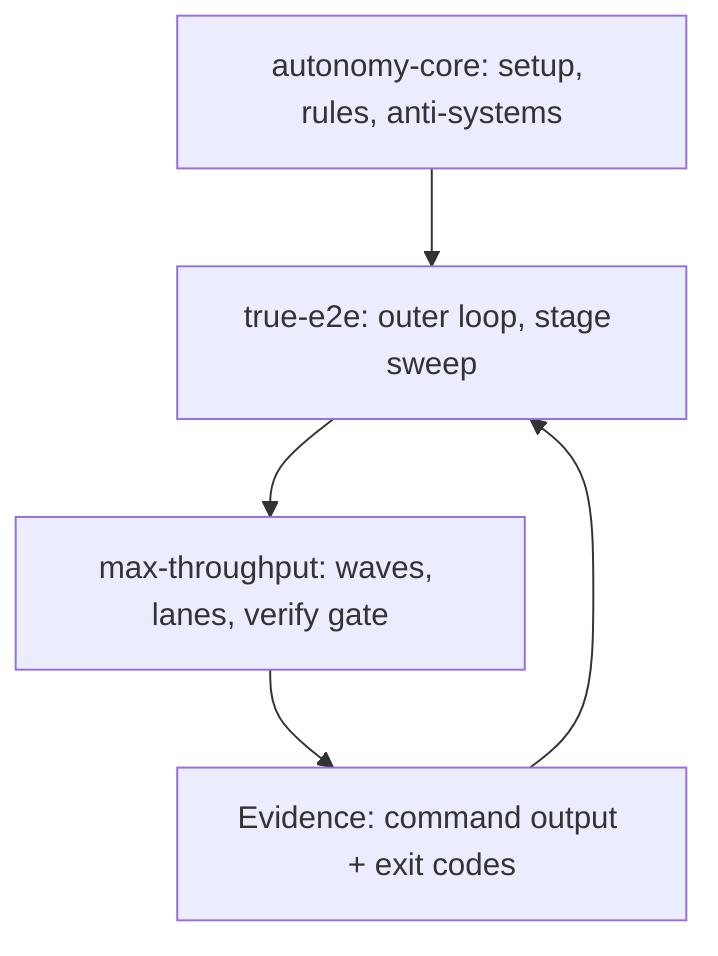

# Autonomy Core — the portable setup

This skill is the **package**. `max-throughput` is the inner engine (how one unit of work is
split and verified), `true-e2e` is the outer loop (how stages chain without stopping), and
`autonomy-core` is what you carry to the next project so both of them have ground to stand
on: the boot contract, the file layout, the per-stage verification cycle, the rule charter and
the anti-systems.

Nothing here is ocrdocs-specific. Every project-specific value — gate commands, stage count,
paths — is a parameter, listed in §2.



## 0. The one-paragraph version

A project is a **charter of numbered stages**, each with its own acceptance wording. An agent
takes one stage through *plan → build → gate → independent adversarial review → bounded
correction → stage-exit checklist → journaled promotion*, and then starts the next stage in
the same step, with no approval prompt. A stage may only be called complete when its own
acceptance evidence exists as files and command output, the repository gate exited `0`, and a
reviewer who did not write the change approved it. Nothing may be weakened to obtain a pass;
anything that cannot pass is **deferred with a named blocker**, never faked and never allowed
to freeze the rest of the roadmap. Everything an agent claims is backed by a command and its
exit code, and everything it learns is written where the next session will find it.

## 1. The seven components

| # | Component | File(s) | Purpose |
|---|---|---|---|
| 1 | **Boot contract** | `.junie/guidelines.md` | Forces the latest skills to be applied at the start of *every* message, with a one-line boot declaration. Without it the rest is optional decoration. |
| 2 | **Rule charter** | `RULES.md` | Highest authority. Evidence, limits, pivots, security, no-fabrication. Read-only to stage work. |
| 3 | **Staged roadmap** | `PROJECT_CHARTER.md` | Numbered stages, each with acceptance wording that *is* the gate. |
| 4 | **Live state** | `STATE.md`, `docs/ACCEPTANCE_REGISTER.md` | What actually changed, and which promises are still unverified. |
| 5 | **Control + evidence plane** | `automation/` (`checkpoint.json`, `promotion.json`, `STOP`, `RENEW`, `runner.lock`, `runs/`, `true-e2e/ledger.md`) | Resumability across sessions, and the owner's stop/renew switches. |
| 6 | **Execution skills + roles** | `.junie/skills/{autonomy-core,max-throughput,true-e2e}`, `.junie/agents/*.md` | How work is parallelised, verified and reviewed. |
| 7 | **Verification gate** | `scripts/verify-gate.ps1` + the project's real check commands | The only thing that may turn a claim into a fact. |

Layout invariant: **`.junie/` is guidance only.** Run logs, ledgers and evidence live under
`automation/` or `$env:TEMP`. A setup that writes artifacts into `.junie/` has already started
to rot.

## 2. Parameters to fill per project

| Parameter | ocrdocs value | Where it lands |
|---|---|---|
| Gate commands | `npm run lint`, `npm test`, `npm run build` | `scripts/verify-gate.ps1 -Checks`, `RULES.md`, guidelines §3 |
| Extra downstream checks | `bun install --frozen-lockfile` | stage plan, S3 |
| Stage count / range | 55 | `PROJECT_CHARTER.md`, `true-e2e` sweep range |
| Runtime bound | ≤72 h per window | `RULES.md`, runner deadline |
| Correction budget | 3 rounds → 1 pivot → defer | `true-e2e` S5 |
| Off-limits paths | `Recovered_C/` | `RULES.md`, agent hard rules |
| Unattended driver | `scripts/autonomy/runner.mjs` | `true-e2e` §4 |

If a project has no runner, the same cycle is driven **interactively** in-session. The gates
never change; only the executor does.

## 3. Install (or re-install) the setup

```powershell
# See exactly what would be created, without writing anything.
powershell -ExecutionPolicy Bypass -File .junie\skills\autonomy-core\scripts\install-autonomy-core.ps1 `
    -TargetRoot C:\path\to\new-project -DryRun

# Install: copies the three skills and six agent roles, seeds the missing core documents,
# creates the automation plane. Idempotent; never overwrites an existing file without -Force.
powershell -ExecutionPolicy Bypass -File .junie\skills\autonomy-core\scripts\install-autonomy-core.ps1 `
    -TargetRoot C:\path\to\new-project -ProjectName new-project -GateCommands 'npm run lint','npm test','npm run build'
```

Then, in the target project, in this order:

1. Fill `PROJECT_CHARTER.md` with real stages and real acceptance wording. A stage whose
   acceptance cannot be checked by a command or an inspectable artifact is not a stage yet.
2. Confirm the gate: `scripts\verify-gate.ps1` must run the project's *actual* checks and
   return a non-zero exit code when they fail. Prove that once, deliberately.
3. Work `checklists/install-verification.md` top to bottom. An unticked line means the setup
   is not installed, whatever the file listing says.
4. Only then start `true-e2e`.

## 4. Per-stage verification — the short form

Full table, per-phase evidence and budgets: `reference/per-stage-verification.md`.

```
S0 reconcile → S1 plan → S2 build → S3 gate → S4 independent review
                  ▲                               │
                  └─── S5 correction (bounded) ◄──┘
                                                  │ approved
S6 stage-exit checklist → S7 record + promote → S8 next stage, same step
```

Five properties make it sound, and each one is load-bearing:

1. **Gate before review** (S3 → S4). A reviewer handed a red gate reviews noise.
2. **Review is independent and fresh.** Author ≠ reviewer, fresh context, receives the
   before/after change set *and every earlier finding for this stage*.
3. **Corrections are re-verified, not argued.** A round re-runs S3 **and** S4 with a fresh
   reviewer. A finding is closed by a change, never by a reply.
4. **Budgets are ceilings on thrash, not permission to quit.** 3 rounds → 1 materially
   different approach → `deferred` with a diagnosis → re-attempted on the next sweep.
5. **Advance is automatic.** S8 starts S1 of the next stage in the same step; the ledger row
   is the summary, written while the next stage is already planning.

## 5. The rules, in one place

`reference/rules-charter.md` holds the portable charter (evidence, limits and recovery,
scope discipline, data handling). The five that break the system if dropped:

1. Evidence is command output with an exit code. A self-report, a green-looking summary and a
   successful agent exit are not passes.
2. A defect needs a reproduction that **fails before** the fix.
3. Never weaken, skip, disable or delete a check to obtain a pass; never mark a stage complete
   while its acceptance evidence or an external gate is outstanding.
4. Never self-approve, at any level.
5. Gates are not workspace: `RULES.md`, `PROJECT_CHARTER.md`, the runner code and its tests,
   the verification scripts and `automation/` control files are read-only to stage work.
   Changing a gate is an owner-recorded decision.

## 6. The anti-systems

Each safeguard exists because of a specific way autonomous work fails. Full catalogue with
failure mode, mechanism, detection signal and the evidence that clears it:
`reference/anti-systems.md`.

| Anti-system | Stops | Mechanism |
|---|---|---|
| Anti-fake-pass | "Done" without proof | Gate exit codes + acceptance artifacts, both required |
| Anti-self-approval | Author blessing own work | Fresh independent reviewer; author ≠ reviewer is a hard stage failure |
| Anti-gate-tampering | Editing the ruler to fit | Gate files read-only to stage work; changes are owner-recorded |
| Anti-check-weakening | Skips, `@Ignore`, softened asserts | Stage-exit checklist line + reviewer mandate to hunt for it |
| Anti-hot-loop | Retrying without learning | Bounded attempts; a retry needs a *new recorded diagnosis* |
| Anti-runaway-pivot | Rewriting the app over a timeout | Pivots must be proportional to the defect and materially different |
| Anti-voluntary-stop | "Shall I continue?" | Only two honest end states: complete, or a terminal external ledger |
| Anti-frozen-roadmap | One blocker freezing everything | Defer the blocked stage, sweep on, revisit each sweep |
| Anti-stall (progress guard) | Spinning forever to look busy | 3 sweeps with zero state change ⇒ terminal external ledger |
| Anti-amnesia | Losing work to a session end | Checkpoint + journal + append-only ledger; resume mid-stage |
| Anti-collision | Two writers, one file | One writer per file; shared files edited by the orchestrator pre-fan-out |
| Anti-secret-leak | Secrets in logs/reports | No secrets in args, VCS, state, logs; off-limits paths never opened |
| Anti-assumed-approval | Imagining an external sign-off | Credentials, legal/security review and customer acceptance can never be assumed |
| Anti-silent-extension | Quietly buying more runtime | Deadline renewal needs an owner `automation/RENEW` token, consumed once and recorded |

## 7. Auditing an existing install

Use this when asked whether the system "is logically sound" in a project:

1. Does `.junie/guidelines.md` force the boot at the **start of every message**, in every
   mode, with a declared boot line? If it is advisory, the system is off.
2. Do the skill bodies present agree with `RULES.md`, and does `RULES.md` still win?
3. Run the gate. Does it fail when it should? Un-exercised gates are decoration.
4. Pick the last stage marked complete and try to reproduce its evidence from files and
   command output alone. If you cannot, it was not complete.
5. Check for self-approval: was the reviewer of the last stage also its author?
6. Check the ledger for a stage that ended a message with a question. That is an
   anti-voluntary-stop violation and should be visible.
7. Check that nothing under `automation/` was hand-edited to mark progress.

## 8. Bundled material

- `reference/rules-charter.md` — the portable rule charter, ready to become a project's `RULES.md`.
- `reference/per-stage-verification.md` — S0–S8 with owners, evidence and budgets, generalised.
- `reference/anti-systems.md` — the fourteen anti-systems in full.
- `checklists/install-verification.md` — tick before declaring the setup installed.
- `templates/guidelines.md.tmpl` — the mandatory-boot guidelines file.
- `templates/RULES.md.tmpl`, `templates/PROJECT_CHARTER.md.tmpl`, `templates/STATE.md.tmpl`,
  `templates/ACCEPTANCE_REGISTER.md.tmpl` — seeds for the core documents.
- `scripts/install-autonomy-core.ps1` — idempotent installer with `-DryRun`.
- `scripts/verify-gate.ps1` — ecosystem-detecting concurrent gate runner for projects that do
  not have one yet.
- `.junie/skills/max-throughput/`, `.junie/skills/true-e2e/` — the engine and the outer loop.
