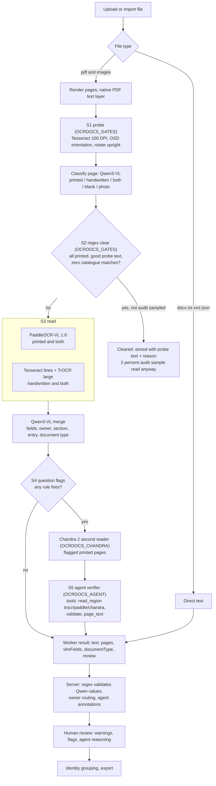
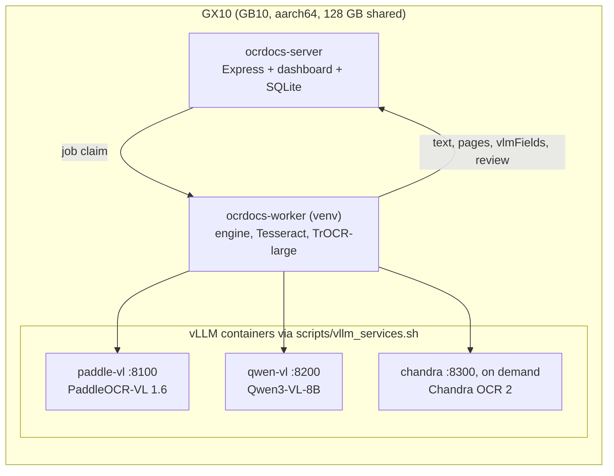

# vlm_v2 pipeline (Paddle-VL + TrOCR + Chandra + Qwen3-VL)

Status: **code complete and unit-tested, not yet deployed or measured on real pages.** `OCRDOCS_PIPELINE` defaults to
`legacy`; nothing changes until it is set to `vlm_v2` on the worker. The DenseNet-121 page triage is written
(`scripts/ocr_triage.py`) but has no trained weights, so the page kind currently comes from the Qwen classifier.

## Flow

Every stage that cannot run degrades to "send it to a human": Paddle down falls back to Tesseract for that page,
Qwen down means "read it with everything" and no merge, Chandra or the agent down leaves the flags standing.

## LlamaParse / LlamaCloud (optional cloud reader, off by default)
**Data warning:** this sends documents to LlamaIndex's servers. Managed LlamaCloud has only North America (`us-east-1`) and
Europe (`eu-central-1`), no Australian region, so every page sent leaves Australia (Privacy Act, APP 8: the owner decides).
The vendor states files are cached 48 hours then deleted and never used for training. Every job here is submitted with
`disable_cache` and deleted (parse, classify and extract jobs) as soon as its result is read; the API key lives only in
the worker's environment.

| Mode | What is sent |
|---|---|
| `region` | only the crops the agent asks to re-read (`llamaparse` tool) |
| `page` | also whole flagged printed pages as a second reader |
| `full` | every PDF, image and docx: one upload gives a parse job; **Classify** (custom rules) and **Extract** (custom schema) both run off it |

Full mode details:
- **Custom extraction JSON** (`scripts/llamacloud/extract_schema.json`) is generated from the regex catalogue
  (`node scripts/build_extract_schema.mjs`): every catalogue field id with its printed labels and format hint, an
  `applicant` object, and an `other_people` array with a `relationship` so parents, spouse, employer and referees never
  land in the applicant's fields ("John and Mary" with "boilermaker, nurse" gives two parent entries in order). A test
  fails if the file drifts from `src/data/bankFields.ts`; LlamaCloud validated the schema (200 on `/extract/schema/validation`).
- **Custom classify rules** (`scripts/llamacloud/classify_rules.json`) are exactly the pipeline's `document_type` taxonomy,
  each with an Australian-document description. The cloud classification leads when its confidence is at least 0.6.
- **Reconcile:** Qwen and the cloud fields are matched by (field, owner, entry). Agreement raises confidence and settles
  an unstated owner; disagreement keeps the better-supported value at reduced confidence, records the other as
  `alternateValue`, and raises `SOURCES_DISAGREE` for the agent; a disputed document type raises `DOC_TYPE_DISAGREE`.
- Verified live on invented pages only (never a real document): upload, classify and extract off one parse job, per-field
  confidence and citations, and 200s on every delete. `cost_effective` parsing kept line text verbatim where `agentic`
  rewrote a form and dropped a label, so parsing defaults to `cost_effective` and extraction to `agentic`.
- **Engine wiring** is applied with `apply_llamacloud_engine.py` (a reviewed one-off patch, so the change that makes the
  worker send files offshore is a deliberate step). Until then `OCRDOCS_LLAMAPARSE` has no effect on the worker.

### Australian (Sydney) endpoint and the desktop bulk script
LlamaIndex offers an Australian endpoint to enterprise customers (not in the public docs; the URL comes from the
customer's agreement). `region "au"` in `scripts/ocr_llamaparse.py` reads it from `OCRDOCS_LLAMAPARSE_BASE_URL` and refuses
anything that is not https or that is one of the public North America/Europe hosts, so it cannot be mislabelled.
`scripts/llamaparse_bulk.py` (a self-contained copy is on the Desktop in `llamaparse_bulk/`) sends a file list through the
Australian endpoint only: dry run by default, `--run` plus `--endpoint-host <host>` (typed to confirm) to send, `--check`
to prove the endpoint and key on an invented page, resumable, capped by `--max-files`. **Unverified:** the Australian
endpoint's exact URL, auth and API paths; the script assumes the public v2 API shape until those details arrive.

## Rules that protect real data
- **S2 parks, never deletes.** Only a file whose pages are all printed, whose probe read enough good text, and that
  matches no catalogue label or value shape is parked. Handwriting is never judged by the probe (Tesseract cannot read it).
  A fixed 2 percent of parked files (`ocr_gates.AUDIT_RATE`, chosen by document name) are read in full anyway, so the miss rate is measurable.
- **Qwen is not trusted with digits.** A value whose digits no OCR engine read is flagged and given low confidence
  (`ocr_qwen_merge`), and on the server it never overrides a regex reading.
- **Owner routing.** Only applicant-owned values fill the catalogue fields identities group on. A parent's or referee's
  value becomes its own field (`Parent 2: Given Names`), a missing owner is always a warning, and a regex hit that
  matches only another person's value is downgraded (`server/services/vlmFieldMerge.ts`).
- **The agent cannot invent a correction.** In code (`ocr_agent_verify._settle`), a correction is accepted only if it
  cites a region and its value appears in something a reader produced; confirmed digits must be found in a reading or
  the stored text; otherwise the verdict becomes `unresolved` for a human. Budgets: 8 steps, 10 tool calls, 180 s.

## Switches (worker environment)

| Variable | Default | Effect |
|---|---|---|
| `OCRDOCS_PIPELINE` | `legacy` | `vlm_v2` enables everything below |
| `OCRDOCS_GATES` | `false` | S1 probe + orientation and S2 clear |
| `OCRDOCS_CHANDRA` | `false` | Chandra second reader on flagged printed pages |
| `OCRDOCS_AGENT` | `false` | S5 agent verifier on flagged files |
| `OCRDOCS_PADDLE_URL` | `http://localhost:8100` | Paddle-VL endpoint |
| `OCRDOCS_QWEN_URL` / `OCRDOCS_QWEN_MODEL` | `http://localhost:8200` / `qwen-vl` | classify, merge |
| `OCRDOCS_CHANDRA_URL` | `http://localhost:8300` | Chandra endpoint |
| `OCRDOCS_AGENT_URL` / `OCRDOCS_AGENT_MODEL` | Qwen URL / model | agent chat endpoint |
| `OCRDOCS_TRIAGE_WEIGHTS` | unset | DenseNet triage weights (module written, not wired) |
| `OCRDOCS_LLAMAPARSE` | `off` | `region`, `page` or `full`: see LlamaParse / LlamaCloud below. Also needs `LLAMA_CLOUD_API_KEY` in the worker environment only |
| `OCRDOCS_LLAMAPARSE_TIER` / `_REGION` | `cost_effective` / `na` | parse tier; `na` or `eu` |
| `OCRDOCS_LLAMAEXTRACT_TIER` | `agentic` | Extract tier (`cost_effective` or `agentic`) |
| `OCRDOCS_LLAMAPARSE_MAX_CALLS` | `200` | files or pages sent per worker process; raise it deliberately for a bulk run |

## Stack

## Runbook (each restart needs the owner's OK)
1. `scripts/vllm_services.sh fetch qwenvl` (Qwen3-VL-8B is not on the box yet), then `start paddle`, `start qwenvl`.
   Each start refuses to run without enough free memory. Chandra needs ~48 GB free: start it only when `OCRDOCS_CHANDRA=true`.
2. Deploy scripts with `scripts/gx10_deploy.sh` (its import check now covers every new module).
3. Add the env vars above to the worker drop-in (`runtime.conf`), `systemctl daemon-reload`, restart `ocrdocs-worker` only.
4. Smoke test: upload one handwritten form; check `pages[]` kinds and engines, merged fields, and `review.flags` in the
   extraction metadata. Then run a few dozen files with gates OFF, read the flag rates (`ocr_question_score.flag_rates`),
   and only then turn on gates, Chandra and the agent one at a time.
5. **Rollback:** `OCRDOCS_PIPELINE=legacy`, restart the worker. No migration is involved; everything new lives in
   `extraction_json`.

## Not yet done
- LlamaCloud on real documents: never run; only invented pages were sent. No graded comparison of the cloud fields
  against Qwen, and no measured cost per document (an agentic extract of a one-page synthetic form used 5 credits).
- Real-page evaluation: graded digit accuracy of Paddle vs Chandra vs TrOCR vs Qwen on BSB, account number and DOB.
- `vllm_services.sh` has been syntax-checked only; it has not started a container on the GX10. The Qwen3-VL-8B launch
  flags (memory fraction, quantization) are unmeasured.
- DenseNet-121 triage needs labelled pages and training; until then the Qwen classifier decides the page kind.
- Chandra's weights are modified OpenRAIL-M (free below $2M funding/revenue, not for competing with the vendor's API):
  confirm this fits before running it on production data.
